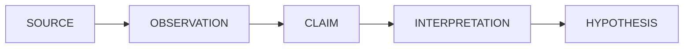

# Aspirations

Ideas that are part of the Wargs design vision but **not yet implemented**.
The implemented architecture is documented in
[../architecture.md](../architecture.md). Items move out of this file as
they land in code.

---

## Richer evidence model

Separate the layers of what evidence *is*:



Example:

```text
Source:        Infineon annual report
Observation:   Automotive revenue declined X%.
Claim:         Infineon's automotive segment experienced a decline.
Interpretation: This may explain part of Infineon's weaker performance.
Hypothesis:    Different market exposure contributes to the performance gap.
```

Today, evidence is a raw task result plus an evaluator verdict; there is no
explicit observation/claim/interpretation separation, which would prevent
treating a source's interpretation as established fact.

## Provenance / source layer

First-class source metadata on every evidence item:

```text
Evidence
├── source
├── source_type            # primary vs secondary
├── published_at / retrieved_at
├── URL / identifier
├── source_family
└── related_sources[]      # duplication detection
```

And harness-level source analysis: source diversity, independence,
duplication, temporal relevance, geographic coverage. The goal is not
“this source is unbiased” but:

> “How dependent is our conclusion on this particular source or source family?”

Today the only provenance is the References appendix in the report (task ID
→ URLs), built deterministically by the harness.

## Hypothesis evolution

Hypotheses that can:

```text
spawn      # new hypothesis from evidence or contradictions
merge      # two hypotheses collapse into one
split      # one hypothesis decomposes into sub-hypotheses
remain unresolved
```

Today the hypothesis set is fixed after generation; alternatives surface
only in the report (via the contradiction step), not as tracked state.

## Richer investigation state

Additional tracked state:

```text
├── open_questions[]       # explicit gaps the investigation hasn't closed
├── timeline[]             # temporal reconstruction of events
├── pending_tasks[] / completed_tasks[]   # persistent task queue
└── full event taxonomy    # see below
```

## Full event log taxonomy

A complete audit trail of every significant transition:


Today there is state-transition logging plus an `events[]` list that
records `confidence_update` and `force_finish` events only.

## More tools

Beyond `WebSearch` (Tavily):

* dataset queries,
* structured APIs (financial, academic, ...),
* document fetching / reading.

The registry (`REGISTERED_TOOLS`) and stable `tool_name` mechanism already
support this; only the tool implementations are missing.

## Full CLI

A dedicated CLI exposing the whole lifecycle:

```text
$ wargs investigate "Why is Infineon doing worse than NVIDIA?"
$ wargs inspect 8c0c87b9
$ wargs resume 8c0c87b9
$ wargs replay 8c0c87b9
$ wargs evaluate dataset.yaml
```

with a live status view (hypotheses + confidences, current task, evidence
counts). Today the surface is `app.py -q` and programmatic resume.

## Evaluation harness

A harness to run investigations against a dataset of questions with known
answers and score them (accuracy of surviving hypothesis, calibration of
confidences, cost/latency budgets).

## Stronger reliability boundaries

Extend what the harness enforces so an agent can never silently:

* invent a tool,
* bypass validation,
* mutate state directly,
* exceed per-tool or per-time budgets (today only step budgets, per-step
  timeouts, and retries are enforced),
* skip provenance,
* declare the investigation finished arbitrarily (today FINISH comes from
  the DecisionAgent; only the neutral-streak force-finish overrides it).
