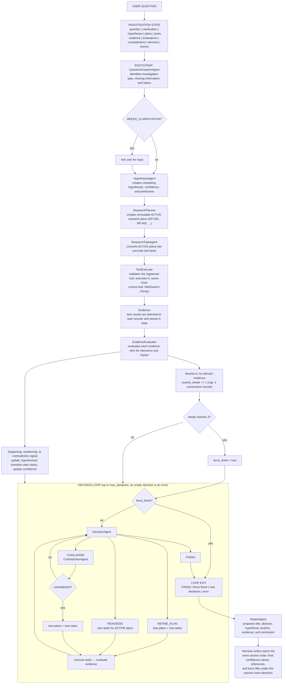

# Investigation Flow

This diagram summarizes the implemented Wargs investigation flow from
`src/core/orchestrator/investigator.py`, with agent and tool responsibilities from
`src/core/agent/agent.py` and `src/tools/executor.py`.

## Ownership boundary

Agents propose structured outputs. The orchestrator owns state transitions,
plan lifecycle status, tool execution, confidence updates, retries, budgets,
stopping conditions, report rendering, and trace persistence.
